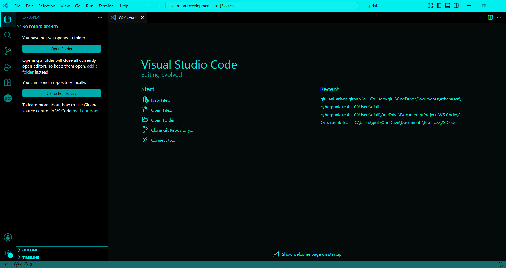
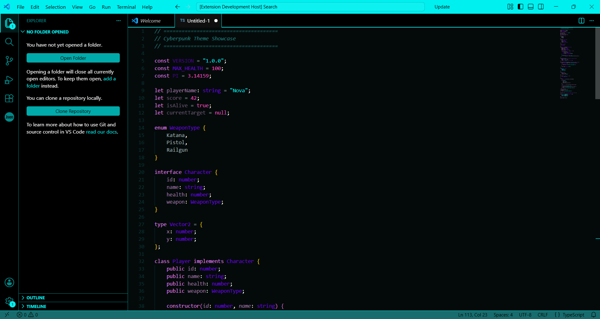

# Cyberpunk Teal

## Showcase Photos

<a href="https://x.com/overratedgalaxi" title="overratedgalaxi">Theme icon created by overratedgalaxi</a>

## Theme

Built around a deep charcoal background, it delivers strong contrast while remaining easy on the eyes during long coding sessions.

Bright teal accents define the interface, while the syntax colors use vibrant pinks, purples, indigos, and blues to make code structure clear without overwhelming the editor. The result is a clean, modern look that feels both electric and readable.

### Features
- Dark background for comfortable coding without straining your eyes
- Neon teal interface accents
- Vibrant pink, purple, indigo, and blue syntax colors
- High-contrast colors designed for readability
- Suitable for web development, scripting, and general programming

## About Me

Hello! I am overratedgalaxi, a graphic designer who works on games, websites, apps, and UI themes. This is a theme I made for VS Code called Cyberpunk Teal. It was inspired by <a href="https://themes.vscode.one/user/toribio" title="toribio on vscode.one">toribio's</a> VS Code theme, <a href="https://themes.vscode.one/theme/toribio/kscitOxw" title="Cyberpunk - Yellow Theme by toribio">Cyberpunk - Yellow Theme</a>.

Check out my <a href="https://github.com/overratedgalaxi" title="overratedgalaxi on GitHub">GitHub</a> to see what else I'm working on. I also post my projects on <a href="https://x.com/overratedgalaxi" title="overratedgalaxi on X">X</a>.

If you request a different theme color or different syntax text colors, I could probably make that for you. Feel free to get in touch on <a href="https://x.com/overratedgalaxi" title="overratedgalaxi on X">X</a>!

**Thanks for using my theme, I hope you like it!**